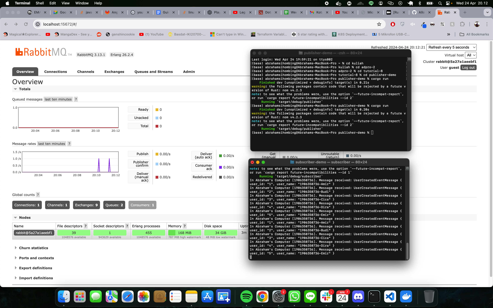
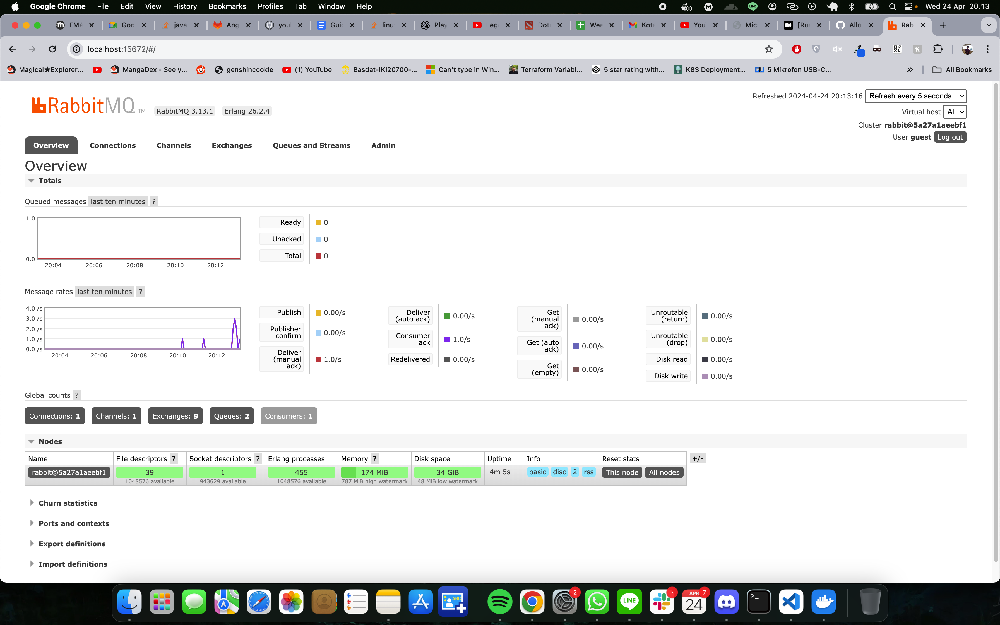
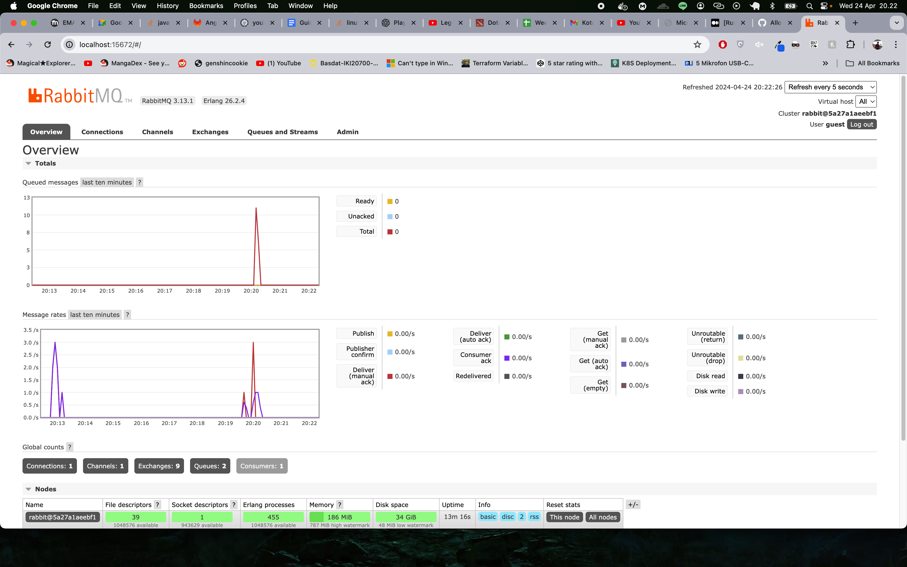
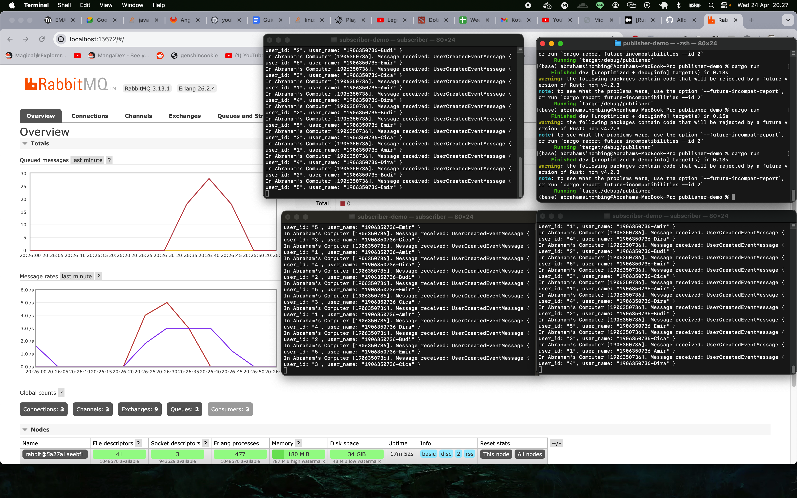

## “Understanding subscriber and message broker.”
### a. What is AMQP?
AMQP (Advanced Message Queuing Protocol) is an open standard protocol for message-oriented middleware. The protocol enables interoperability among message brokers and clients, providing robust messaging capabilities that support a wide range of messaging applications, including those required in enterprise environments.

### b. What does "guest:guest@localhost:5672" mean?
- The first `guest` is the username used to connect to the message broker.
- The second `guest` is the password for authentication.
- `localhost:5672` specifies the server address and port where the message broker is running. Here, `localhost` means the broker is running on the local machine, and `5672` is the default port for AMQP brokers.
"""

The publisher publish the message and received by the message queue and then later will be acked by subscriber.

The spike is caused by publisher that keeps publishing message. As we can see, i run the publisher code 3 times in a 5 second time frame that totaling to an aggregated spike of 3 message per sec.

the number of queued messages is the number of messages that are waiting to be acked by the subscriber. because the subscriber only can acked to one message at a time, this cause the queue to be spiking.

the number of queued messages reduced much faster because there are more subscriber that can acknowledge the messages. Rabbit mq distributes the queued messages to different subscribers so it reduced quicker.