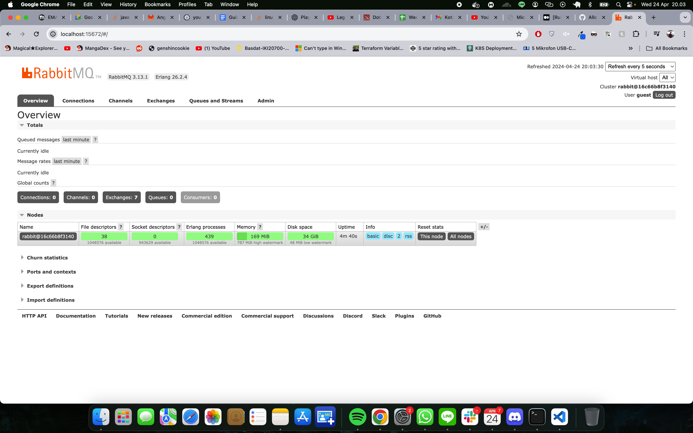

## “Understanding subscriber and message broker.”
### a. What is AMQP?
AMQP (Advanced Message Queuing Protocol) is an open standard protocol for message-oriented middleware. The protocol enables interoperability among message brokers and clients, providing robust messaging capabilities that support a wide range of messaging applications, including those required in enterprise environments.

### b. What does "guest:guest@localhost:5672" mean?
- The first `guest` is the username used to connect to the message broker.
- The second `guest` is the password for authentication.
- `localhost:5672` specifies the server address and port where the message broker is running. Here, `localhost` means the broker is running on the local machine, and `5672` is the default port for AMQP brokers.
"""
